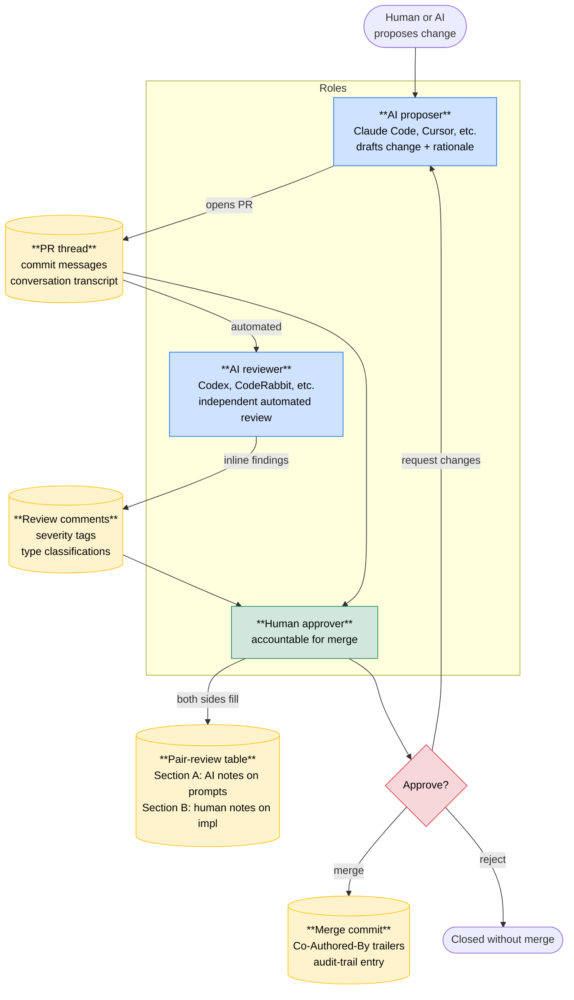

# Workflow figure

A single-figure description of the AI-Human Pair Programming with
Cross-Vetting flow, with audit artifacts called out at each step.
Intended for use in the article (§2 — the cross-vet practice) and
for adopters who want a one-look overview.

For the prose description of the workflow, see
[`../METHODOLOGY.md`](../METHODOLOGY.md). For the per-cadence audit
artifacts produced, see [`audit-artifacts.md`](audit-artifacts.md).

## Figure



## How to read it

**Three role boxes** (top, in `Roles` subgraph):

- **AI proposer** (blue) — drafts the change and the rationale.
  Reads the codebase, considers context, produces a diff + commit
  messages + a PR description.
- **AI reviewer** (blue) — independent automated review. Different
  vendor / model preferred to reduce monoculture risk. Posts
  inline findings with severity tags.
- **Human approver** (green) — reads the diff + the AI proposer's
  reasoning + the AI reviewer's findings. Fills the pair-review
  table. Makes the merge decision.

**Four audit artifacts** (yellow cylinders):

- **PR thread + commit messages + conversation transcript** —
  per-instance evidence of what was proposed and why.
- **Review comments + severity tags** — automated reviewer's
  findings, with type classifications enabling cross-PR analysis.
- **Pair-review table (Section A + B)** — the methodology-distinctive
  artifact that makes pair programming structurally visible. Both
  sides contribute; both sections must be non-empty.
- **Merge commit + Co-Authored-By trailers + audit-trail entry** —
  per-instance closure record, plus attribution to AI co-authors
  via standard trailer convention.

**One decision point** (red diamond): approve / request changes /
reject. The methodology forbids automated merge — the diamond is
always reached by a human.

## What the figure deliberately omits

To keep the figure scannable, several real-world details are not
shown:

- **Iteration loops** — in practice, "request changes" cycles back
  to the AI proposer multiple times before approval. The figure
  shows this as one back-edge but the typical PR has 1-3 cycles.
- **Multiple AI proposer sessions** — a long-running PR may have
  contributions from multiple AI conversation sessions. The
  conversation-transcript artifact covers all of them.
- **Critical-path escalation** — for security / financial /
  life-safety changes, a second human reviewer is added per the
  methodology's critical-path category list. Not shown here for
  clarity; mentioned in the figure caption when used in publication.
- **Per-period audit checks** (quarterly competence assessments,
  methodology drift checks) — those operate at a different cadence
  and don't fit on a single per-PR figure. See
  [`audit-artifacts.md`](audit-artifacts.md) for the full picture.
- **Cross-PR linkage** — when one PR's deferred finding becomes a
  follow-up PR (e.g., PR #58's P2 → PR #59), the methodology
  tracks this via PR-body cross-references. Not visible at the
  per-PR level shown here.

## Variations

For different deployment contexts, the figure adapts:

- **No AI reviewer available:** the AI reviewer box is replaced by a
  second human reviewer. Methodology degrades to traditional
  human-cross-vet but retains the rest of the structure.
- **Multiple AI proposers:** common in practice (one for code, one
  for tests, etc.). Each opens its own PR, or contributions are
  merged into a single PR with multiple `Co-Authored-By` trailers.
- **Self-cross-vet on documents** (as for the article producing
  this methodology): the same flow applies, with "merge" replaced
  by "publish" and "diff" by "draft." The figure structure holds.

## Source / regenerating

The Mermaid source above is the canonical figure. To export as PNG /
SVG for publication (e.g., CACM article), use the Mermaid Live Editor
(`mermaid.live`) or local CLI (`mmdc`).

For the publication version of the figure, recommended exports:

- **PNG at 2x DPI** for online article inclusion
- **SVG** for print versions where vector quality matters
- **A simplified ASCII fallback** for environments that don't
  render images:

```
                  Human or AI
                  proposes change
                       │
                       ▼
              ┌────────────────┐
              │  AI proposer   │
              └────────┬───────┘
                       │ opens PR
                       ▼
        ┌──────────── PR thread ────────────┐
        │      conversation transcript      │
        └─────────┬───────────────┬─────────┘
                  │               │
                  ▼               ▼
          ┌─────────────┐  ┌──────────────────┐
          │ AI reviewer │  │  Human approver  │
          └──────┬──────┘  └─────────┬────────┘
                 │ findings           │
                 ▼                    │
        ┌──────────────────┐         │
        │ review comments  │─────────┤
        │  severity tags   │         │
        └──────────────────┘         │
                                     ▼
                          ┌─────────────────────┐
                          │  Pair-review table  │
                          │  Section A + B      │
                          └──────────┬──────────┘
                                     ▼
                                ┌────────┐
                                │Approve?│
                                └────┬───┘
                                     │
                       ┌─────────────┼─────────────┐
                       │             │             │
                       ▼             ▼             ▼
                  request        merge         reject
                  changes        commit       (closed)
                  (loops)
```
