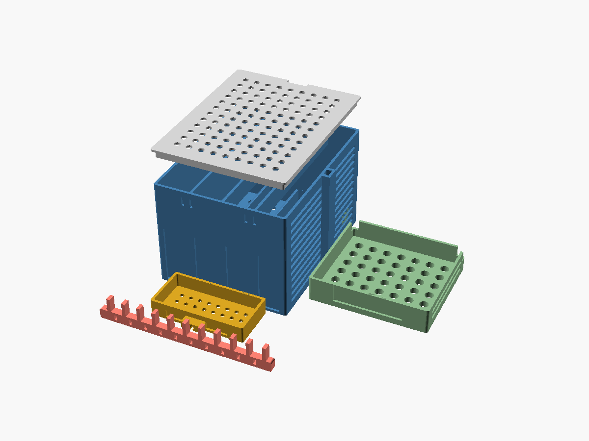

# rogue-organizer

A modular, 3D-printable desktop case that organizes the **`rogue`** home-server
stack (Beelink SER6 Pro running Proxmox + its USB NAS drives) and tidies the
cabling.

Holds:

- **4× Orico 3.5" single-drive USB enclosures** — stood vertically in a vented,
  lidded box (smallest footprint, best convection cooling between drives)
- **1× Beelink SER6 Pro mini PC** — open-top vented cradle
- **1× USB hub** — clip-in tray
- **Cables** — rear comb "spine" with cable channels + zip-tie slots, plus
  standalone snap clips and zip-tie anchor points built into the box/cradle

Everything is one parametric OpenSCAD file: `rogue-organizer.scad`.



> The lid is shown exploded above the box. Orange faces in the per-part renders
> are just OpenSCAD's preview shading of interior surfaces — not errors.

## Parts

| Part | File | Footprint (mm) | Notes |
|------|------|----------------|-------|
| Drive box (4 bays) | `stl/drive_box.stl` | 162 × 195 × 125 | vented, dovetail groove on one side |
| Drive lid | `stl/drive_lid.stl` | 153 × 195 × 11 | friction-fit, vented, finger notch |
| Mini-PC cradle | `stl/minipc_cradle.stl` | 141 × 122 × 29 | vented floor on standoffs, dovetail tongue |
| USB hub tray | `stl/hub_tray.stl` | 109 × 64 × 19 | keyhole wall mount |
| Cable spine | `stl/cable_spine.stl` | 200 × 8 × 28 | comb + zip-tie slots + screw ears |
| Cable clip | `stl/cable_clip.stl` | 16 × 14 × 12 | print several |

All parts are manifold single bodies and fit a **220 × 220 mm** bed.
(The drive box is 195 mm deep, so it will **not** fit a 180 mm bed such as a
Bambu A1 mini — see caveats.)

## >>> Before you print: confirm the measurements <<<

The model is driven entirely by variables at the top of the `.scad`. Edit and
re-export — no CAD skills needed.

```scad
orico   = [186, 118, 31.4];  // your enclosure L x W x T  (measured)
beelink = [126, 113, 42];    // mini PC W x D x H          (spec sheet)
hub     = [100, 45, 15];     // USB hub W x D x H          (ASSUMED - measure!)
```

Fit tuning (loosen/tighten for your printer):

```scad
clear   = 1.5;   // gap around each inserted part
lid_gap = 0.35;  // lid skirt clearance
dt_cl   = 0.4;   // dovetail joint clearance
```

## Print settings (suggested)

- Material: **PETG** preferred (the drives + Ryzen run warm; PLA can creep/soften
  in a hot enclosure). PLA is fine if the lid stays off.
- Layer height: 0.2–0.28 mm
- Walls: 3 perimeters · Infill: 15–20% gyroid
- **Supports: none needed.** Every part is designed to print flat-side-down:
  louvers are horizontal slots (self-bridging), holes are ≤10 mm.
- Orientation: print each part as exported (box opening up, lid top-up, cradle
  floor-down, spine on its base).

## Assembly

1. Print all parts (×4 enclosures share one box, so just one `drive_box`).
2. **Box ↔ cradle:** slide the cradle's dovetail tongue down into the box's
   side groove. Snug? Increase `dt_cl`. Loose? Decrease it, or add a drop of
   glue / an M3 screw through the joint.
3. Stand the 4 Orico enclosures in the box bays, ports facing the **rear** (the
   rear wall has a cable slot per bay).
4. Drop the Beelink into the cradle (it rests on the internal standoffs for
   under-airflow). Use the corner cutouts to lift it back out.
5. Hang the hub tray on an M3 screw via its keyhole, or zip-tie it to the spine.
6. Route power/USB leads through the rear cable slots into the spine's channels;
   cinch bundles with zip ties through the slots; mount the spine to the desk or
   the box rear via its two screw ears.
7. Snap the lid onto the box (leave it off if you want maximum cooling).

## Regenerate STLs / images

```bash
# one part
openscad -o stl/drive_box.stl -D 'part="drive_box"' rogue-organizer.scad

# preview image (headless needs a virtual framebuffer)
xvfb-run -a openscad -o img/drive_box.png -D 'part="drive_box"' \
  --imgsize=1200,900 --colorscheme=Tomorrow --projection=p --viewall --autocenter \
  rogue-organizer.scad
```

Valid `part` values: `layout` (preview-only), `drive_box`, `drive_lid`,
`minipc_cradle`, `hub_tray`, `cable_spine`, `cable_clip`.

## Cross-vet — known weak points

In the spirit of this repo, here are the design's honest counter-arguments:

1. **Heat is the real risk.** Four 3.5" HDDs plus a Ryzen 9 6900HX in/near a
   closed box generate meaningful heat. The passive louvers + floor vents help,
   but a sealed lid can still trap warm air. **Mitigations:** run the box with
   the lid off, keep the mini PC cradle (open-top) physically separate from the
   box, or add an active fan. A fan mount (80/92 mm) is **not yet a part** — easy
   to add if you want forced airflow.
2. **No dedicated power-brick / PSU bay yet.** The spine + zip-tie anchors route
   and bundle cables, but the 5–6 wall-warts (4 enclosures + Beelink + hub) are
   currently just bundled, not boxed. A rear brick caddy / power-strip holster
   is a natural next part once brick counts and sizes are confirmed.
3. **Bed size assumed 220 mm.** The drive box (195 mm deep) won't fit smaller
   beds; it would need splitting into front/back halves for a 180 mm printer.
4. **Joint clearances are printer-dependent.** `lid_gap` and `dt_cl` are first
   guesses — print one corner test if you want to dial them in before committing
   to the big box.
5. **Hub dimensions are assumed.** `hub = [100, 45, 15]` is a placeholder; the
   tray will be wrong until you measure the actual hub.

## Provenance

Mini PC identified from the home-lab vault note *"Beelink SER6 Pro Mini PC —
Home Server Setup Guide"* (hostname `rogue`). Enclosure dimensions measured by
the user off the packaging. Beelink dimensions cross-checked against the
manufacturer spec sheet.
